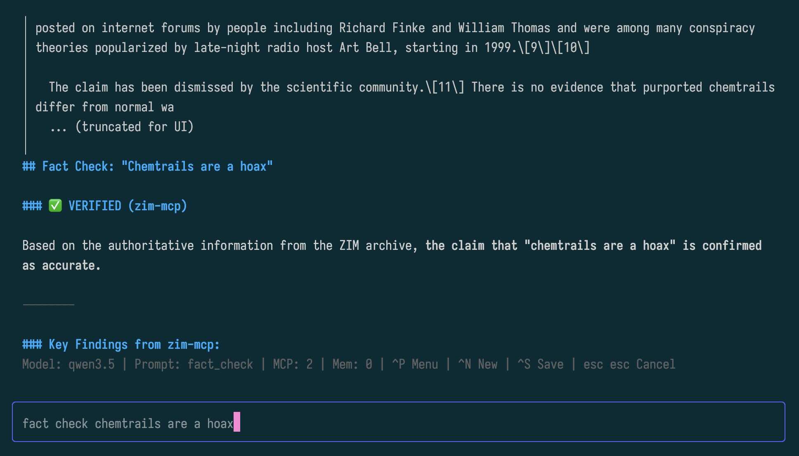

# prmptr

A highly flexible, terminal-based LLM client designed for rapid iteration, prompt engineering, and deep debugging of the Model Context Protocol (MCP).



## Why prmptr?

`prmptr` was build out of frustration. Most terminal AI clients and RAG frameworks are heavily oriented towards autonomous software development (coding agents). They make it surprisingly tedious to do simple things like switch to a different model, swap out a system prompt, or dynamically toggle MCP tools on and off. 

`prmptr` is different. It is driven by a single, simple configuration file (`prmptr.yaml` loaded from current directory). It's designed to be a lightweight, transparent testbed where you have full control over the context, the tools, and the models, making it the perfect companion for development and experimentation.

## ✨ Features

- **The Ultimate MCP Debugger:** Watch your LLM's thought process in real-time. `prmptr` beautifully renders the exact Tool Calls and the resulting JSON outputs directly in the chat history.
- **Save Raw Interactions:** Hit `Ctrl+S` to dump the *entire* conversation history to a local Markdown file. Unlike the UI which truncates massive JSON responses to keep things readable, the saved export includes the **raw, untruncated data** from all tool calls—perfect for debugging misbehaving MCP servers.
- **On-the-fly Toggles (`Ctrl+P`):** Instantly pop open the quick-menu to switch models (OpenAI, Ollama, etc.), change your active system prompt, or enable/disable specific MCP servers mid-conversation.
- **Smart Context Memory (BM25 RAG):** Ever had an MCP tool return a 150,000-token JSON blob that crashes your LLM's context window? `prmptr` intercepts massively oversized tool responses, stores them in Go's local memory, and provides the LLM with a built-in RAG tool (`query_memory`) powered by BM25 to safely extract only the relevant chunks.
- **Advanced Terminal Input:** Features multi-line input (`Shift+Enter`), native mouse selection/copying (hold `Shift`), and Emacs-style keybindings (`Ctrl+A`, `Ctrl+E`).


## Install

```bash
go install github.com/akhenakh/prmptr@latest
```

## Configuration

Create a `prmptr.yaml` file in your working directory. You can define multiple providers, models, system prompts, and MCP servers here:

```yaml
providers:
  ollama:
    base_url: "http://localhost:11434"
  openai:
    api_key: "sk-proj-..." # Or use environment variables in your real setup

models:
  - name: "llama3"
    provider: "ollama"
    max_context_size: 8192
  - name: "gpt-4o"
    provider: "openai"
    max_context_size: 128000

mcp_servers:
  - name: "local_filesystem"
    type: "stdio"
    command: "npx"
    args: 
      - "-y"
      - "@modelcontextprotocol/server-filesystem"
      - "/tmp"

system_prompts:
  - name: "default"
    content: "You are a helpful AI assistant. Think step-by-step."
  - name: "coding"
    content: "You are a senior developer. Be concise and output code blocks where appropriate."
```

## Keyboard Shortcuts

| Shortcut | Action |
| :--- | :--- |
| `Enter` | Send prompt to the LLM |
| `Shift+Enter` / `Alt+Enter` | Add a new line to your prompt |
| `Up` / `Down` | Navigate through your prompt history |
| `Ctrl+P` | **Open Menu** (Switch Models, Prompts, Manage MCPs) |
| `Ctrl+S` | **Save History** (Dumps full, untruncated conversation to `.md`) |
| `Ctrl+N` | Start a new session (Clears history and context) |
| `Esc Esc` | Cancel generation / Clear current input text |
| `Ctrl+C` | Quit `prmptr` |

*Note: To select and copy text natively from the terminal using your mouse, simply hold the `Shift` key while dragging.*

## Credits

A massive thank you to the [Charm](https://charm.sh) ecosystem. `prmptr` is built on the bleeding edge of their new V2 stack, leveraging:
- [Bubble Tea v2](https://github.com/charmbracelet/bubbletea) for the declarative UI state machine.
- [Lip Gloss v2](https://github.com/charmbracelet/lipgloss) for beautiful terminal styling.
- [Glamour](https://github.com/charmbracelet/glamour) (v2 experimental) for the gorgeous Markdown rendering.
- [Fantasy](https://github.com/charmbracelet/fantasy) for the unified, seamless LLM and Tool routing framework.

